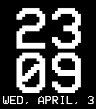
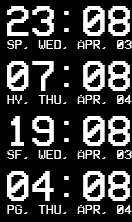

# Rainmeter Skin Configuration: "Clocks"

## Single Clock: PixelTime Skin
### Description
The "PixelTime" skin, authored by TomCoperations and adapted by Lucas Dourado, showcases an 8-bit style clock displaying hours, minutes, and the date. It provides a nostalgic pixel-art aesthetic for the desktop, utilizing the "VCR OSD Mono" font for a retro vibe.

### Features
- **_MeasureHours, MeasureMins, MeasureDate:_** These measures capture the current time (hours, minutes) and date, formatting them for display.
- **_BitStyle:_** A unified style for text elements, using the "VCR OSD Mono" font in white, with uppercase string styling and right alignment.
- **_Meters:_** Separate meters for hours, minutes, and date. Each is styled with BitStyle and positioned centrally, with sizes adjusted for visual hierarchy.

### Unique Elements
The skin merges aesthetic appeal with functionality, offering a clear view of the time and date in a style reminiscent of early digital clocks.

## Multi Clocks: Global Time Display
### Description
Lucas Dourado expands on TomCoperations' idea with the "Multi Clocks" skin, displaying the current time and date across multiple cities: São Paulo, San Francisco, Hyderabad, and Prague. Each city's time is adjusted for its respective timezone, offering a global perspective right from the desktop.

### Features
- **_MeasureTime and MeasureDate for Each City:_** Tailored measures capture and display the time and date for São Paulo (SP), San Francisco (SF), Hyderabad (HYD), and Prague (PRG), considering their time zones.
- **_TextStyle:_** Consistent with the PixelTime skin, it uses the "VCR OSD Mono" font in white, maintaining the retro digital look.
Unique Elements
- **_Timezone Awareness:_** Each city's time measure includes a timezone adjustment, ensuring accurate local times.
- **_City-Specific Labels:_** The date format includes a short city label (e.g., "SP" for São Paulo), providing a quick reference.

### Summary
These configurations demonstrate a creative use of Rainmeter to bring both charm and utility to the desktop. The "PixelTime" skin offers a singular, stylish clock, while "Multi Clocks" expands this concept to a worldly view, tracking multiple time zones in a unified design. Both skins leverage the nostalgic appeal of the "VCR OSD Mono" font, emphasizing clarity and a throwback aesthetic.

## Preview
_Single Clock_:

_Multi Clocks_:

