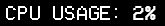

# Rainmeter Skin Configuration: "CPU Display"
This document details the configuration for a Rainmeter skin called "CPU Display". This skin is designed to present the current CPU usage on the user’s desktop, providing a quick and visual way to monitor system performance.

## Configuration Overview
### Components of the Skin
- **_BackgroundImage:_** Establishes a background for the skin using a solid color (black) with the dimensions of 75 pixels in height and 65 pixels in width.
- **_MeasureCPU:_** A measure that captures the CPU usage of the system.
- **_TextStyle:_** Defines the appearance of text within the skin. It utilizes the "VCR OSD Mono" font in white, includes antialiasing for smoother text rendering, and centers the text.
Display Meters
- **_MeterUsed:_** This meter displays the label "CPU Usage:" in uppercase. It employs the "VCR OSD Mono" font, styled according to the BitStyle, with white font color and size set to 15. It is positioned with its right edge at x=147 pixels and y=0 pixels from the top.
- **_MeterUsedPercent:_** This meter shows the CPU usage percentage, linked to the MeasureCPU. Styled similarly to MeterUsed, it displays the percentage right next to the "CPU Usage:" label, auto-scales the value for readability, and includes antialiasing. It is aligned to the left with its position starting at x=150 pixels and y=0 pixels from the top.

## Summary
The "CPU Display" skin is engineered to provide an aesthetically pleasing and efficient way to keep an eye on CPU utilization, utilizing a minimalist design that fits well on any desktop. Its use of the retro-inspired "VCR OSD Mono" font adds a touch of nostalgia while maintaining clarity and readability, making it a practical addition for monitoring system resources.

## Preview
