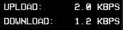

# Rainmeter Skin Configuration: "Network Display"
This configuration outlines a Rainmeter skin named "Network Display". The skin is created to show network activity, including upload and download speeds, on the user's desktop.

## Configuration Details
The skin includes several key components:

- **_BackgroundImage:_** Sets up a background with a solid black color (minimal opacity), dimensions being 75 pixels in height and 65 pixels in width. Adjustments may be necessary to fit text and meters appropriately.

- **_measureIP:_** (Commented out) A measure designed to return the user's IPv4 address. It uses the WebParser plugin to fetch the address from https://checkip.amazonaws.com/ and updates every 4 hours. Empty results are substituted with "N/A".

- **_measureNetIn:_** Measures incoming network traffic (download speed), displaying values in bits and scales according to the maximum download speed set by the user.

- **_measureNetOut:_** Measures outgoing network traffic (upload speed), with values in bits and scaled based on a predefined maximum upload speed.

- **_TextStyle:_** Defines a uniform style for text across the skin, using the "VCR OSD Mono" font in white, with antialiasing enabled for smoothness, and all text in uppercase.

## Specific meters include:
- **_MeterUploadLabel:_** Displays the label "Upload:" with specified styling, positioned on the skin.

- **_MeterUploadValue:_** Shows the current upload speed in bits per second (bps), auto-scaled for readability, with one decimal place for precision.

- **_MeterDownloadLabel:_** Displays the label "Download:" similarly styled and positioned.

- **_MeterDownloadValue:_** Indicates the current download speed in bps, also auto-scaled and with one decimal point.

The configuration highlights the skin's focus on providing real-time network statistics in a visually appealing and informative manner, ideal for users who wish to monitor their internet connection directly from their desktop.

## Preview
